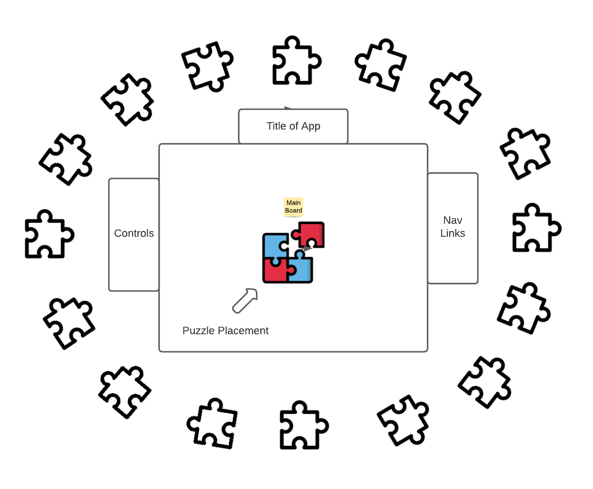

# MuralDash

<body>

   
  
  <h2>Background & Overview</h2>
  
 
   MuralDash is an interactive artwork racing game.
  

  
  <h2>Functionality & MVP</h2>
  

    <h3>Mural Dash will be a top-down racing game and will have the following core functionality for a minimum viable product:</h3>
    <ul>
      <li> Users can control the speed of the car with designated arrow keys.</li>
      <li> Users can render a background image of a specified harvard museum picture.</li>
      <li> Users will have the option to pick a different theme song.</li>
     </ul>
  

  
  

    <h3>In addition to these features, the application will feature:</h3>
    <ul>
      <li> An About modal describing the background and rules of the game. </li>
      <li> A production ReadME </li>
    </ul>
   

  
  <h2>Wireframes</h2>
  

    This is a single paged app that will feature a main board with a race track on a default background. The user will be prompted to set up their environment with a background image or song prior to playing. There will be designated buttons to instruct on how to control the car on the right as well as background and song buttons(3 of each that can mix and matched)The nav links will feature the relevant links to my github, linkedin, and portfolio site. The title will be placed along the side above the controls(bonus features may include more than 3 song options and more than one background image to be rendered from the museum api.)
   
    
  

  
  <h2>Architecture and Technologies</h2>
  
  

    <h3> This project will implement the following technologies:</h3>
      <ul>
        <li>tone.js for various song choices</li>
        <li>paper.js to create the shape of the track</li>
        <li>harvard art museum for used images(im not sure yet!)</li>
      </ul>
      <h3> This project will feature the following scripts:</h3>
      <ul>
        <li>board.js for game logic and elements for user control</li>
        <li>chord.js for song options logic </li>
        <li>museum.js for combining api and render logic(bonus for random image background)</li>
      </ul>
  

  
  <h2>Implementation Timeline</h2>
    <h3> Day 1: </h3>
      

        Create more options for songs that will play. I have familiarity with tone.js and an original song for my MuralDash with tone.js. I will create two other songs and assign them to buttons that can be played when clicked.
       

    <h3> Day 2: </h3>
      
 Research paper.js logic for rendering shape of the track and begin design for the race car. By E.O.D. I should have a rendered race track and overall board shape finished.
      

     <h3> Day 3: </h3>
     
 Finish race car design and start to work on controls for the car to follow the race track.

     <h3> Day 4: </h3>
     
 Continue work on race car controls and begin logic for win/loss or infinite amount of play.

     <h3> Day 5: </h3>
     
 Finalize overall design of race track with animations based on win/loss.

     
  <h2> Bonus Features </h2>
    Ideally, I want this to be a real fun and interactive experience that is captivating through an audio and visual aspect, but provides the user with some sort of challenge. 
    

      <ul>
        <li>Create a random artwork button that will render a random image from the museum api based on category</li>
        <li>Allow user to create their own theme song with a selection of 3-5 notes and a play button that will loop.</li>
      </ul>
    

</body>
