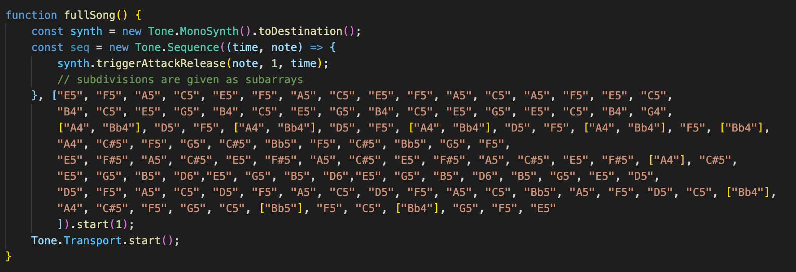

<body>
  <h1> MuralDash</h1>
  
Top-down endless javascript racing game.

   
  
  

  
  <h2> Overview </h2>
  
  
  <h3> Controls & Objective </h3>
  
  The objective of the game is to dodge incoming cars as you increase or decrease your speed. Use the up, down, left, and right arrow keys to increase/decrease or dodge the cars on the road. You have 3 lives which are decrimented each time you collide with a car and if the counter reaches "0", then your game is over.
  
  <h3> Technologies </h3>
  
  * Javascript 
  * Tone.js
  
  
  
  
  The theme song is an original song that I transcribed to work with the library, tone.js. Above, you can see the individual notes of the song that is on a constant loop. I provided a play and pause button for an added element of immersion into this arcade style racer.
  

  
  <h2>Functionality</h2>
  

    <h3>Mural Dash will be a top-down racing game and has the following core functionality:</h3>
    <ul>
      <li> Users can control the speed of the car with designated arrow keys.</li>
      <li> Users will have the option to play/pause original theme song.</li>
     </ul>
  

  
 
  <h2> Bonus Features </h2>
    Ideally, I want this to be a real fun and interactive experience that is captivating through an audio and visual aspect, but provides the user with some sort of challenge. 
    

      <ul>
        <li>Create a random artwork button that will render a random image from the museum api based on category</li>
        <li>Allow user to create their own theme song with a selection of 3-5 notes and a play button that will loop.</li>
      </ul>
    

</body>
